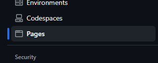
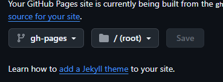

# Basic Authentication in MERN

## Table of Contents

-   [Setting Up React App (Vite)](#setting-up-react-app-vite)

-   [Setting Up GitHub Pages](#setting-up-github-pages)

-   _[Coming Soon](#)_

## Setting Up React App (Vite)

1.  To set up a new React App using Vite, run the following command in your terminal:

    ```bash
    npm create vite@latest mern_auth --template react
    ```

    ```bash
    cd mern_auth
    ```

    ```bash
    npm install
    ```

    ```bash
    npm run dev
    ```

2.  Install the necessary dependencies::

    ```bash
    npm install react-router-dom bootstrap react-bootstrap bootstrap-icons
    ```

3.  Import Bootstrap CSS/JS/Icons in `src/main.jsx`:

    ```javascript
    import "bootstrap/dist/css/bootstrap.min.css";
    import "bootstrap/dist/js/bootstrap.bundle.min.js";
    import "bootstrap-icons/font/bootstrap-icons.css";
    ```

4.  Create following Pages in `src/pages/` directory:

    -   `Home.jsx`
    -   `Login.jsx`
    -   `Register.jsx`

5.  Add Code to each page as in the code files.
6.  Edit App.jsx to include routing:

    ```javascript
    import React from "react";
    import { BrowserRouter, Route, Routes } from "react-router-dom";
    import "./App.css";
    import Home from "./pages/Home";
    import Login from "./pages/Login";
    import Register from "./pages/Register";

    function App() {
        return (
            <>
                <BrowserRouter>
                    <Routes>
                        <Route path="/" element={<Home />} />
                        <Route path="/login" element={<Login />} />
                        <Route path="/register" element={<Register />} />
                    </Routes>
                </BrowserRouter>
            </>
        );
    }

    export default App;
    ```

7.  **[Bonus]** Add Custom styles to the App.css file:

    ```css
    .home-card,
    a,
    .btn {
        transition: all 0.2s ease-in-out;
    }

    .home-card:hover,
    .btn:hover {
        transform: scale(1.03) rotate(2deg);
        box-shadow: 0 4px 20px rgba(0, 0, 0, 0.75);
    }

    .home-card:active,
    a:active,
    .btn:active {
        box-shadow: inset 0 3px 18px rgba(0, 0, 0, 0.65), inset 0 2px 6px rgba(0, 0, 0, 0.45);
    }
    ```

8.  **[Bonus]** Add Custom styles to the index.css file:

    ```css
    @import url("https://fonts.googleapis.com/css2?family=Bebas+Neue&family=Inter:ital,opsz,wght@0,14..32,100..900;1,14..32,100..900&display=swap");
    #root {
        --heading-font: "Bebas Neue";
        --body-font: "Inter";
    }
    h1,
    h2,
    h3,
    h4,
    h5,
    h6 {
        font-family: var(--heading-font);
    }
    p,
    a,
    button,
    input,
    label,
    span,
    div,
    li,
    td,
    th {
        font-family: var(--body-font);
    }
    ```

## Setting Up GitHub Pages

1.  Create a new Repository on GitHub & Add the project to the repository.
2.  Install `gh-pages` package:

    ```bash
    npm install gh-pages --save-dev
    ```

3.  Run the following command to build the React App:

    ```bash
    npm run build
    ```

4.  Add the following property to the `package.json` file:

    ```json
    //...
    "homepage": "https://aarishmughal.github.io/mern_auth/",
    //...
    ```

5.  Add the following scripts to the `scripts` object in `package.json`:

    ```json
    //...
    "predeploy": "npm run build",
    "deploy": "gh-pages -d dist",
    //...
    ```

    _The keyword `dist` refers to the directory where the build files are located. In case of Vite, it is `dist`. If the project is created using Create React App, it would be `build`._

6.  Make sure to add `base` url in the vite.config.js file:

    ```javascript
    //import { defineConfig } from "vite";
    //import react from "@vitejs/plugin-react";

    //export default defineConfig({
    //    plugins: [react()],
        base: "/mern_auth/", // Set base for GitHub Pages deployment
    //});
    ```

7.  Once `package.json` is updated, run the following command in the terminal to begin deployment:

    ```bash
    npm run deploy -- -m "Deploy React app to GitHub Pages"
    ```

8.  This will create a new branch called `gh-pages` in your repository and deploy the React app to GitHub Pages.

9.  Go to the `Settings` tab of your repository on GitHub, scroll down to the `Pages` section, and select the `gh-pages` branch as the source. Save the changes.

10. Your React app should now be live on GitHub Pages at the URL specified in the `homepage` property of your `package.json`. To apply any changes, simply run the command in the **Step 07** again:

        ```bash
        npm run deploy -- -m "Deploy React app to GitHub Pages"
        ```

    <!-- _More Information Coming Soon..._ -->
